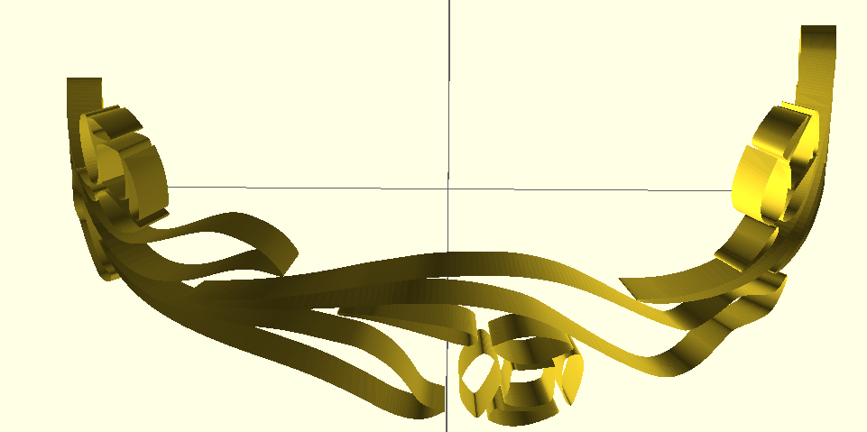

SCADTrace
=========

This is a script set to convert a black-and-white bitmap into an
openscad object suitable for using to emboss a cylindrical object.

It uses potrace to generate an SVG representation of the shape.  potrace rocks.

It then uses a python script to parse the SVG and generates openscad geometry.

from this:

to this:

Work in Progress
----------------

The openscad geometry generated does not yet include the inner or outer faces.
OpenSCAD polyhedrons are expressed as triangles, so we need to tesselate the face polygons
before we can generate the face geometry.  I think the best solution will be to 
use [Triangle](http://www.cs.cmu.edu/~quake/triangle.html).

We also need to ensure that the triangle faces are small enough to wrap
around the outside of the cylinder, although that may fall out of triangle naturally.
Maybe we can specify a maximum size of the tesselation triangles?
